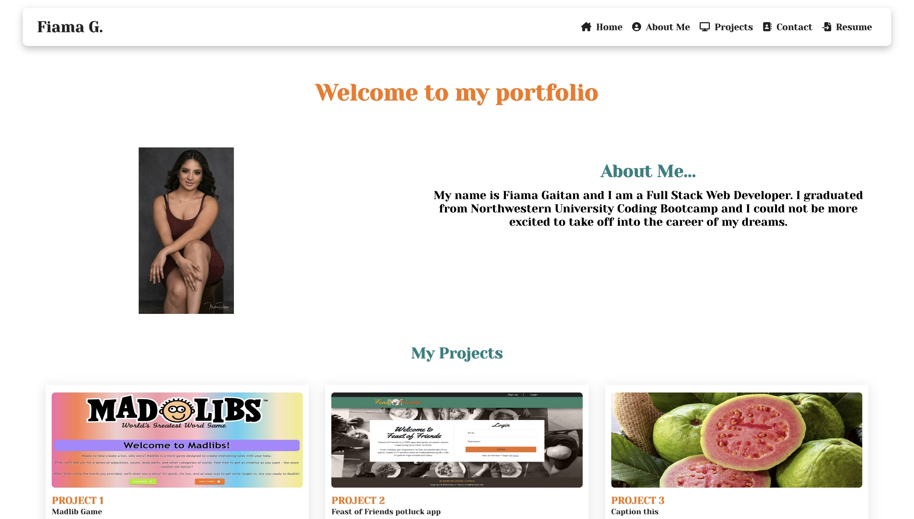

# <v2_React-Profile>

## Description

React Profile

- The motivation for this week's challenge was to create a portfolio (single-page) using React.

- I built this project to have an updated profile with better functionality so that it is easier to edit and update by separate components without interrupting functionality as a whole.

- What this project solves is preventing a page's functionality to stop working as a whole, or in other words crash if something breaks or stop working in the page. This is essentially why we are using REACT because that is the functionality it provides for us and single page websites.

- That i can update parts of my profile without having to change an entire block of code, that I can use component names within and resuse as needed. I actually learned a lot about React's functionality and how i can better use what I already know from previous parts and reconfigure them for better use in React. Essentially I learned I can work smarter and not harder but it took me working really hard to realize I didn't need to do everything I had aleaedy done .

## Table of Contents (Optional)

- [Installation](#installation)
- [Usage](#usage)
- [Credits](#credits)
- [License](#license)

## Installation

- Include and Download React in package.json if not creating a separate react app, otherwise :

Use : 

- npx create-react-app Nameyourapphere

This command will create your react application within and will include most packages needed, as well as automaically install them when you run the command 

- If you're not sure, to install packages you can run : 

npm i 

- npm run start will start your application on a server and you may start working on functionality from there.

## Usage

- Deployed application link :
https://flgaitan.github.io/v2_React-Profile/

- GitHub repo:
https://github.com/flgaitan/v2_React-Profile

- npm run start : starts the page on the browser from VS code

## Credits

- Collaboration with classmates, tutors, class recording and Youtube videos:

https://www.youtube.com/watch?v=9VGnASEE8i8
https://www.youtube.com/watch?v=x7mwVn2z3Sk
https://www.youtube.com/watch?v=0dOSLhPzSGI&t=4819s
https://www.youtube.com/watch?v=b9eMGE7QtTk
https://www.youtube.com/watch?v=Ke90Tje7VS0
https://www.youtube.com/watch?v=7WwtzsSHdpI&t=375s

## License

MIT

---

🏆 

## Features

- REACT
